# Kotlin Burp Jwt Session Token Handler Demo

This project demonstrates how to:
1. Create a session handling action that extracts a JWT from a login macro response and uses it in future requests both as a cookie and authorization bearer header
2. Allow the tester to configure the Jwt search pattern, cookie name, and header name + prefix and save it as persistent project-level setting. This makes the extension reusable across multiple applications without having to hard code logic for specific cases.

To automatically persist project level settings in Burp and offer a user interface for modifying those settings, this project uses https://github.com/ncoblentz/BurpMontoyaLibrary. It allows an extension writer to define the settings they want to persist, the level of persistence (project level or Burp preference level), and then automatically generate a UI for updating those settings without having to deal with Java's Swing Library.

## Setup

This project was initially created using the template found at: https://github.com/ncoblentz/KotlinBurpExtensionBase. That template's README.md describes how to:
- Build this and other projects based on the template
- Load the built jar file in Burp Suite
- Debug Burp Suite extensions using IntelliJ
- Provides links to documentation for building Burp Suite Plugins

## Handling Jwt Session Tokens Automatically

The following examples use traffic generated from visiting and interacting with the following project hosted locally:
- https://github.com/juice-shop/juice-shop
 
### Defining and Using The Settings

Start by creating properties on our class to hold settings specific to our extension, so they can be accessed throughout the class.

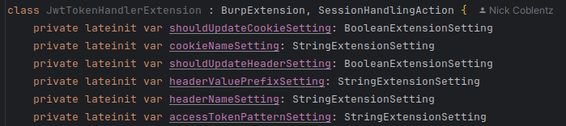

Next, initialize each of those settings in the `init` function of the Burp Extension.

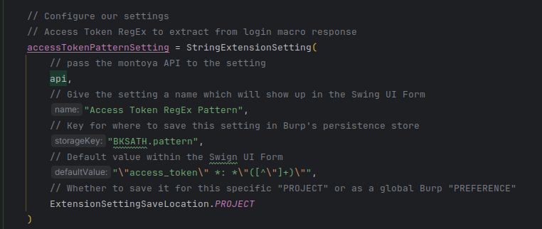

Pass a list of the settings to the `GenericExtensionSettingFormGenerator` and build the form. It will create a user interface automatically to allow management of the settings. Register a right click context menu to access that settings UI. 

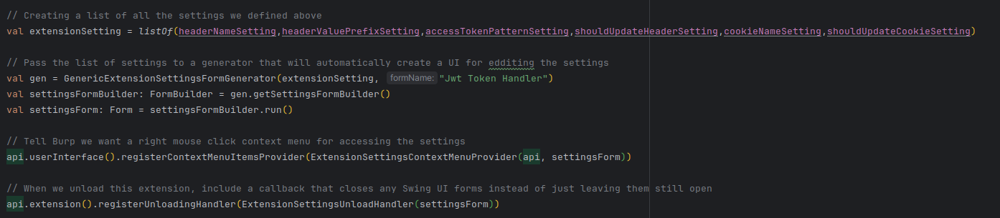

### Using The Settings

Use the settings by accessing the `currentValue` property for that setting
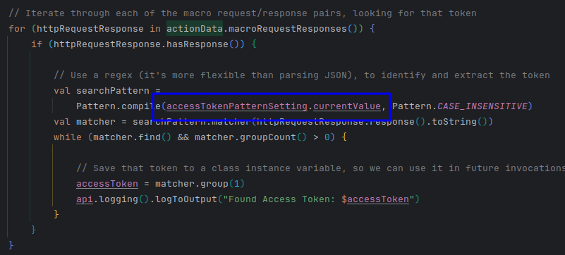

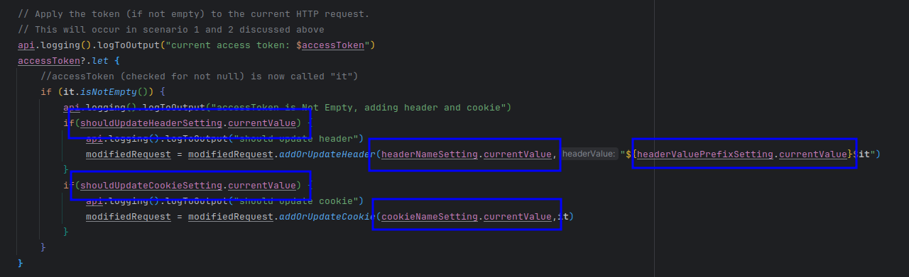

### Extract the Jwt from the Login REST call

When logging into Juice Shop, the application returns a `token` JSON value in the response body that contains the Jwt/bearer token. This plugin defines a session handling action that will extract that token when used by Burp's "Is In Session" rule.

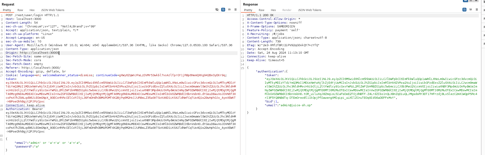

In the `init` function, tell Burp we intended to offer a session handling action.

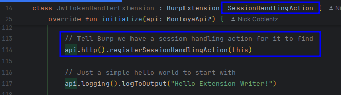

Then, create a `performAction` method to satisfy the `SessionHandlingAction` interface requirements.

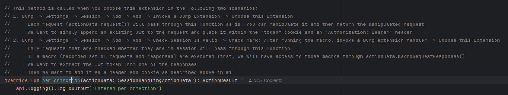

Within that function, extract the token as shown below.

Afterward, apply that token to the current request. In Juice Shop, some features look at the `Authorization: Bearer ` header and others look at the `token` cookie.

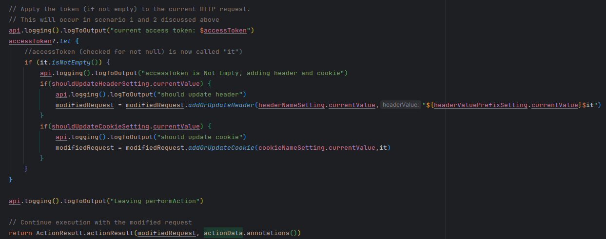

### Changing the Settings in Burp

Access the settings through the right-click context menu

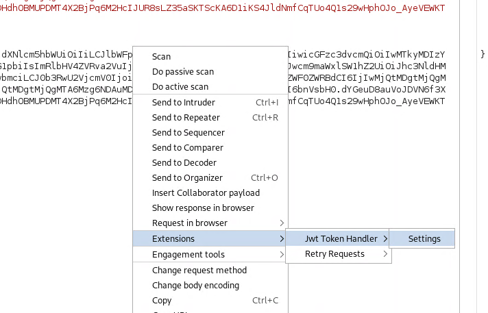

Configure the settings for Juice Shop

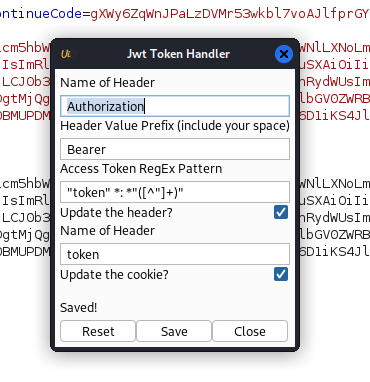

### Create a Login Macro

Select an existing login request from proxy history as a login macro that will be used to automatically log in and obtain a Jwt.

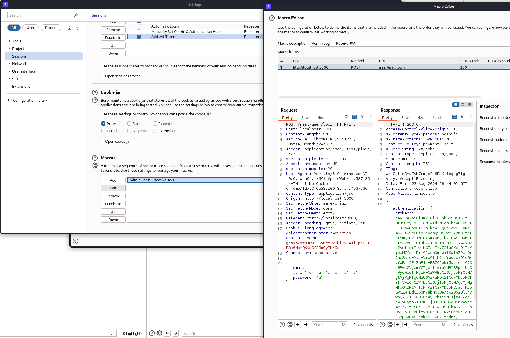

### Set Up a Session Handling Rule

Create a session handling rule with two entries. For the first entry, select these settings.
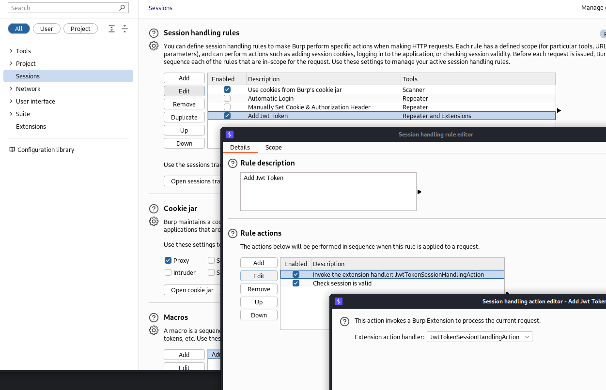

For the second entry, use these settings.

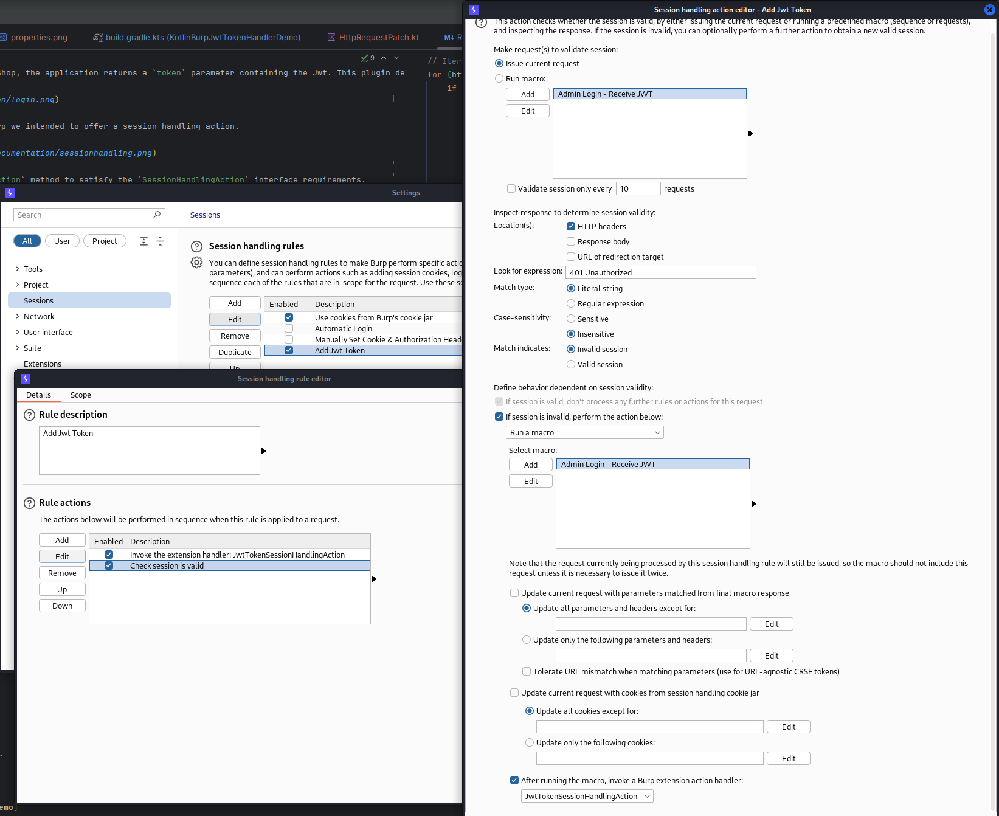

Set the scope to include all URLs (or you could define a scope and choose "Use Suite Scope") and the repeater tool.

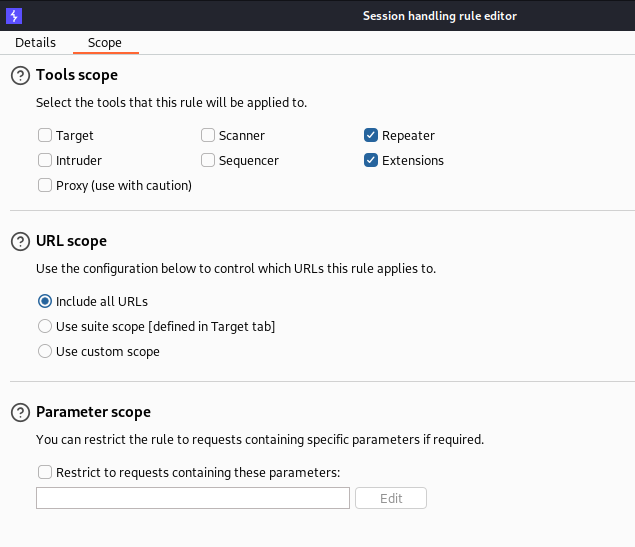

### Try it Out

Open session tracer, so you can track what's happening.

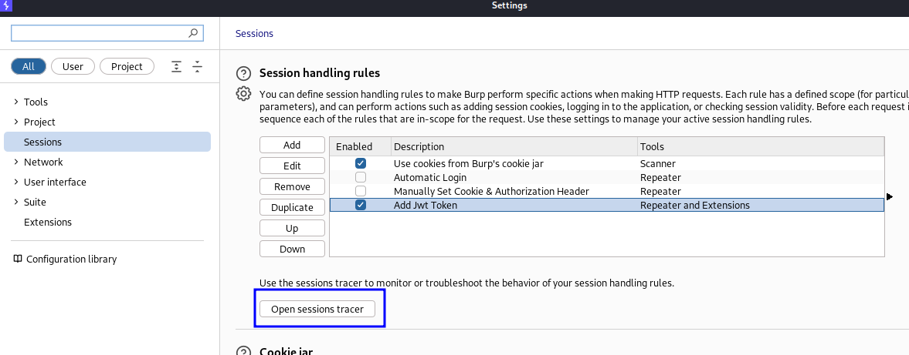

Find a REST request and send it to repeater. Modify the cookie and bearer token, so it will generate a 401. Then, send the request and check whether the session handling rule worked by watching the session tracer.

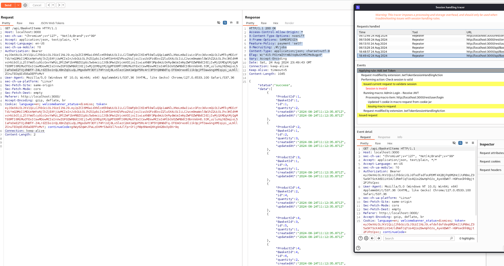